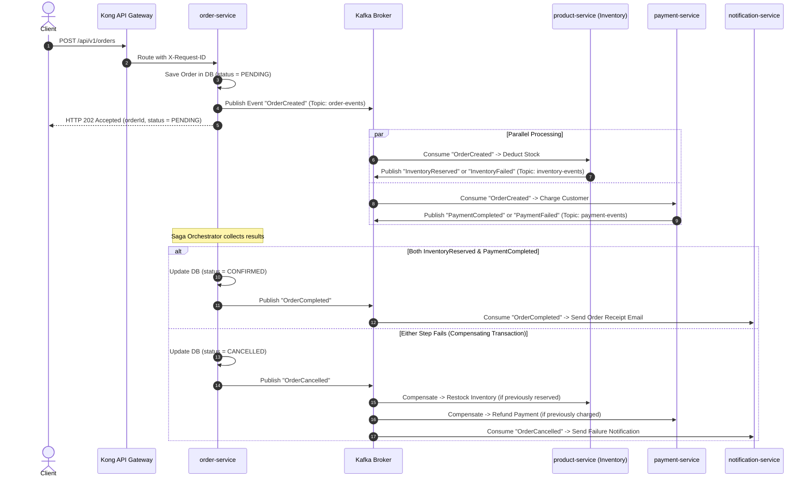

# Architecture & System Design: Enterprise Polyglot E-Commerce Platform

- **Date:** 2026-09-11
- **Status:** Approved
- **Target Repository:** `ecommerce-platform` (Monorepo with Turborepo & pnpm workspace)

---

## 1. Executive Summary & Goals

This document specifies the target architecture, service boundaries, team structure, communication protocols, and resilience patterns for the Enterprise E-Commerce Monorepo platform.

### Key Architectural Tenets
1. **Database-per-Service:** Complete physical and user-level database isolation across domains.
2. **Hybrid Communication Model:** Synchronous gRPC / internal REST for instant queries and validations; Asynchronous Kafka Event Streaming for state mutations and distributed transactions.
3. **Declarative GitOps Infrastructure:** Kong Gateway DB-less declarative routing, automated Kafka KRaft provisioning, and Docker Compose deployment for multi-tier VPS architecture.
4. **Resilient Distributed Workflows:** Saga pattern with Orchestration, Idempotency, Transactional Outbox, and Dead Letter Queues (DLQ).

---

## 2. Service Decomposition & Team Topology (Conway's Law)

The system is decomposed into **5 core services** and **2 shared libraries** distributed across **3-4 cross-functional squads**:

```
ecommerce-platform/
├── libs/
│   ├── contracts/          # Protobuf / gRPC definitions, Event Schemas, Shared TS Types
│   └── common/             # Shared Logger, JWT Verifier, Correlation-ID Middleware, Kafka Utilities
├── services/
│   ├── auth-service/       # Port 3001, DB: auth_db (User Management, RBAC, OAuth2/JWT)
│   ├── product-service/    # Port 8080, DB: product_db + Redis (Catalog, SKU, Read-heavy cache)
│   ├── order-service/      # Port 3002, DB: order_db (Checkout, Order Lifecycle, Saga Orchestrator)
│   ├── payment-service/    # Port 3003, DB: payment_db (Gateway integrations, Webhooks, Ledgers)
│   └── notification-service/# Worker daemon (Kafka consumer for Email/SMS/Push notifications)
└── infra/                  # Declarative Docker, Kafka KRaft, Kong, and VPS automation scripts
```

### Team Mapping
* **Platform & Core Team:** Owns `infra/`, Kong API Gateway, `auth-service`, and `libs/common`.
* **Product & Discovery Team:** Owns `product-service`, Redis caching strategy, and catalog search.
* **Checkout & Fulfillment Team:** Owns `order-service`, Saga orchestration, and `notification-service`.
* **Payments & Fintech Team:** Owns `payment-service`, payment gateway webhooks, and ledger reconciliation.

---

## 3. Communication Matrix

| Source | Destination | Protocol | Use Case | Latency Expectation |
| :--- | :--- | :--- | :--- | :--- |
| **Client** | **Kong Gateway** | HTTPS / REST | Inbound public API requests | `< 100ms` |
| **Kong Gateway** | **Microservices** | HTTP / REST | Routing via `/api/v1/*` with `X-Request-ID` | `< 10ms` (Internal) |
| **order-service** | **product-service** | gRPC | Immediate price check & SKU validation | `< 5ms` |
| **order-service** | **Kafka Broker** | Kafka Protocol | Emit `OrderCreated` / `OrderCancelled` | Async (`< 10ms`) |
| **Kafka Broker** | **payment-service** | Kafka Protocol | Consume `OrderCreated` -> Process Charge | Async |
| **Kafka Broker** | **product-service** | Kafka Protocol | Consume `OrderCreated` -> Deduct Inventory | Async |
| **Kafka Broker** | **notification-service**| Kafka Protocol| Consume events -> Send Email / SMS | Async |

---

## 4. Saga Distributed Transaction Workflow

### 4.1 Event Topics
* `order-events` (Partitions: 3, Retention: 7 days)
* `inventory-events` (Partitions: 3, Retention: 7 days)
* `payment-events` (Partitions: 3, Retention: 7 days)
* `notification-events` (Partitions: 3, Retention: 7 days)

### 4.2 Sequence Flow



---

## 5. Resilience & Fault Tolerance Strategies

### 5.1 Idempotency
* Every Kafka message contains an immutable `eventId` (UUIDv4) and `correlationId`.
* Consumers verify `eventId` against Redis cache / database table `processed_events` before executing mutations. Duplicate events are acknowledged immediately without side-effects.

### 5.2 Transactional Outbox Pattern
* To avoid dual-write inconsistencies between PostgreSQL and Kafka:
  * Application writes state changes and outbox records in a single local database transaction.
  * A lightweight publisher worker polls `outbox_events` and reliably dispatches events to Kafka with at-least-once delivery guarantees.

### 5.3 Dead Letter Queue (DLQ) & Retry Policy
* Transient errors: Exponential backoff with jitter (Retries: 3, Initial delay: 500ms, Multiplier: 2).
* Unrecoverable errors: Route poison messages to dedicated DLQ topics (e.g., `payment-events.DLQ`) for operator alert and replay.

---

## 6. Infrastructure & Deployment Architecture

### 6.1 Database Isolation
* PostgreSQL 16 Alpine multi-database container managed by `init-multiple-dbs.sh`:
  * `auth_db` (owner: `auth_user`)
  * `product_db` (owner: `product_user`)
  * `order_db` (owner: `order_user`)
  * `payment_db` (owner: `payment_user`)
  * `REVOKE ALL ON DATABASE <db> FROM PUBLIC` guarantees strict tenancy.

### 6.2 Gateway & Caching
* **Kong Gateway 3.6 (DB-less):** Declarative `kong.yml` synced automatically into memory on boot. Hot reload via Admin API `curl -X POST http://127.0.0.1:8001/config`.
* **Redis 7 Alpine:** Caching product catalog read models, token blacklists, and idempotency locks with `allkeys-lru` policy.

### 6.3 Operating System & Host Hardening
* **Swap Space:** 4GB host swap with `vm.swappiness=10` via `setup-swap.sh`.
* **Kernel Limits:** `vm.max_map_count=262144` and `fs.file-max=65536` for high-throughput Kafka I/O.
* **Firewall (UFW):** Strict separation between App Node (VPS 1) and Data Node (VPS 2) via `bootstrap-vps.sh`.

---

## 7. Verification & Smoke Testing

All infrastructure components and boundaries are verified via `bash infra/scripts/smoke-test-infra.sh`:
* Verifies database connectivity and cross-database permission isolation.
* Validates Redis ping responses.
* Verifies Kafka broker health and all 4 Saga event topics.
* Confirms Kong Gateway status endpoint and product routing.
