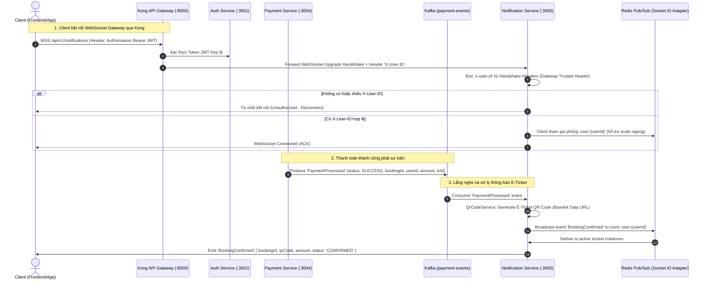

# Kế Hoạch Triển Khai: Notification Service (Milestone 5)

> **Mục tiêu:** Xây dựng `services/notification-service` hoàn chỉnh bằng NestJS (Port 3005), tích hợp Kafka Consumer lắng nghe sự kiện thanh toán thành công (`PaymentProcessed`), sinh mã QR vé điện tử E-Ticket, phát thông báo realtime tới Client qua WebSocket Gateway (Socket.IO) với **cơ chế xác thực Gateway Trusted Header (`X-User-ID`) thuần túy** kế thừa từ Kong API Gateway & `event-service`.

---

## 🗺️ Kiến Trúc & Luồng Dữ Liệu (Architecture Flow)



---

## 📋 Phân Chia Nhiệm Vụ Chi Tiết (Task Breakdown)

### Phase 1: Môi Trường, Dependencies & Configuration
- [x] Cài đặt các dependencies cần thiết trong `services/notification-service/package.json`:
  - WebSocket & Socket.IO: `@nestjs/websockets`, `@nestjs/platform-socket.io`, `socket.io`
  - Redis Adapter: `@socket.io/redis-adapter`, `ioredis`
  - Message Broker: `kafkajs`
  - QR Code Engine: `qrcode`, `@types/qrcode`
  - Cấu hình môi trường: `@nestjs/config`, `joi`
- [x] Thiết lập file cấu hình môi trường `.env.example` và `.env`:
  - `PORT=3005`
  - `KAFKA_BROKERS=localhost:9092`
  - `KAFKA_CLIENT_ID=notification-service`
  - `KAFKA_GROUP_ID=notification-consumer-group`
  - `KAFKA_TOPIC_PAYMENT_EVENTS=payment-events`
  - `REDIS_URL=redis://:redis_secret_123@localhost:6379/0`
  - `CORS_ORIGINS=http://localhost:3000,http://localhost:8000`
- [x] Xây dựng `src/config/configuration.ts` & `src/config/validation.schema.ts` kiểm tra tính hợp lệ của các biến môi trường khi bootstrap.

---

### Phase 2: Gateway Trusted Header Auth & WebSocket Gateway Layer
> Kế thừa 100% cơ chế từ Kong & `event-service`: Xác thực biên do Kong Gateway đảm nhiệm; `notification-service` chỉ đọc và tin tưởng header `X-User-ID`.

- [x] Triển khai `src/auth/guards/trusted-header.guard.ts`:
  - Trích xuất `x-user-id` (case-insensitive) từ `client.handshake.headers['x-user-id']` do Kong API Gateway tiêm vào downstream.
  - Từ chối kết nối ngay lập tức (`client.disconnect(true)`) nếu thiếu `x-user-id` (tương đương phản hồi 401 `missing user identification header` ở `event-service`).
  - Gắn thuộc tính `client.data.userId = userId` để sử dụng xuyên suốt phiên làm việc.
- [x] Triển khai `src/gateway/redis-io.adapter.ts`:
  - Tích hợp `@socket.io/redis-adapter` kết nối Redis Pub/Sub, hỗ trợ mở rộng ngang nhiều replica pod của `notification-service` mà không làm gián đoạn broadcast realtime.
- [x] Triển khai `src/gateway/events.gateway.ts`:
  - Namespace: `/notifications` (khớp với prefix định tuyến `/api/v1/notifications` của Kong).
  - CORS cấu hình lấy từ `ConfigService`.
  - Hook vòng đời kết nối:
    - `handleConnection`: Kiểm tra `WsTrustedHeaderGuard`, tự động gán socket vào room `user:${userId}`.
    - `handleDisconnect`: Thu dọn tài nguyên và log ngắt kết nối.
  - Method `sendToUser(userId: string, event: string, payload: any)`: Gửi thông báo trực tiếp tới room `user:${userId}`.
  - Message handler `ping` -> phản hồi `pong` phục vụ health check và keep-alive socket.

---

### Phase 3: E-Ticket QR Code Generation Service
- [x] Triển khai `src/qrcode/qrcode.service.ts`:
  - Method `generateTicketQRCode(payload: TicketQRPayload): Promise<string>` sinh ảnh QR Code định dạng PNG Data URL (Base64) với độ phân giải và error correction level chuẩn (`M` hoặc `H`).
  - Dữ liệu mã hóa trong QR Code:
    ```json
    {
      "bookingId": "uuid",
      "userId": "uuid",
      "txId": "gateway_tx_id",
      "timestamp": "ISO8601"
    }
    ```
  - Cung cấp tiện ích kiểm tra tính toàn vẹn của mã QR khi giải mã.
- [x] Đóng gói `src/qrcode/qrcode.module.ts`.

---

### Phase 4: Kafka Consumer Service (Message Broker Integration)
- [x] Triển khai `src/kafka/kafka-consumer.service.ts`:
  - Quản lý vòng đời kết nối Kafka (`onModuleInit`, `onModuleDestroy`) bằng `kafkajs`.
  - Subscribe topic `payment-events` với consumer group `notification-consumer-group`.
  - Xử lý message `PaymentProcessed`:
    - Lọc các sự kiện có `status === 'SUCCESS'`.
    - Gọi `QrCodeService` sinh mã QR E-Ticket dạng Base64.
    - Gọi `EventsGateway.sendToUser(userId, 'BookingConfirmed', ...)` để phát dữ liệu vé và QR realtime.
    - Ghi nhận `X-Correlation-ID` trong log để truy vết đồng bộ với toàn hệ thống.
  - Xử lý an toàn lỗi deserialization và error boundary khi gặp message sai format mà không làm crash consumer worker.
- [x] Đóng gói `src/kafka/kafka.module.ts`.

---

### Phase 5: REST API & Health Check Probes
- [x] Chuẩn hóa định dạng phản hồi REST API theo chuẩn chung của hệ thống:
  - `src/common/dto/api-response.dto.ts`: `ApiResponse<T>` `{ success: boolean, data?: T, error?: any }`.
- [x] Triển khai `src/health/health.controller.ts`:
  - Endpoint `GET /api/v1/notifications/health`: Liveness Probe kiểm tra trạng thái sống của app.
  - Endpoint `GET /api/v1/notifications/health/ready`: Readiness Probe kiểm tra trạng thái kết nối tới Kafka broker và Redis.
- [x] Tích hợp `src/app.module.ts` kết nối toàn bộ module: `ConfigModule`, `EventsModule`, `KafkaModule`, `QrCodeModule`, `HealthModule`.
- [x] Cập nhật `src/main.ts`:
  - Thiết lập Global Prefix: `api/v1/notifications`.
  - Bật CORS và nạp cấu hình `RedisIoAdapter`.

---

### Phase 6: Dockerfile & Kong Gateway Routing
- [x] Tạo `services/notification-service/Dockerfile`: Multi-stage build (Node Alpine) tối ưu image size và bảo mật.
- [x] Cập nhật/kiểm tra `infra/kong/kong.yml`:
  - Đảm bảo route `notification-routes` hỗ trợ đầy đủ các protocols WebSocket: `protocols: [http, https, ws, wss]`.
- [x] Viết tài liệu `services/notification-service/README.md` bằng tiếng Việt theo convention dự án (hướng dẫn chạy local, biến môi trường, test WebSocket qua Kong).

---

### Phase 7: Verification & Testing
- [x] Viết Unit Test cho `QrCodeService`, `EventsGateway`, `TrustedHeaderGuard`, `KafkaConsumerService`, `HealthController` (`npm run test` - 17/17 passed).
- [x] Viết kiểm thử E2E (`npm run test:e2e` - 1/1 passed).
- [x] Kiểm tra linter và type check: `npm run lint` (0 errors, 0 warnings) & `npm run build` (compiled clean).

---

## 🎯 Tiêu Chí Hoàn Thành (Done When)
- [x] `services/notification-service` khởi động thành công trên cổng `3005`, kết nối Kafka và Redis thông suốt.
- [x] Route `/api/v1/notifications/health` trả về HTTP 200 `UP`.
- [x] WebSocket handshake xác thực **thuần túy qua `X-User-ID` Trusted Header** từ Kong Gateway (từ chối 100% các kết nối không có header này).
- [x] Nhận event `PaymentProcessed` thành công từ Kafka, tạo mã QR E-Ticket và push realtime xuống đúng socket của user.
- [x] Toàn bộ unit test và build compile TypeScript thành công không có lỗi lint/type.
